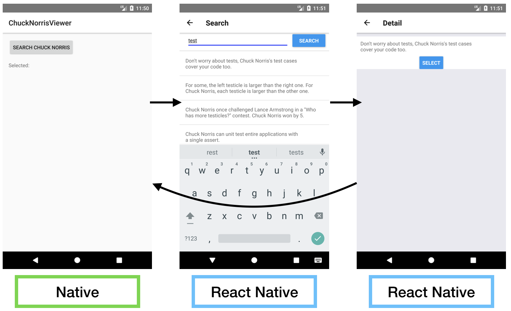
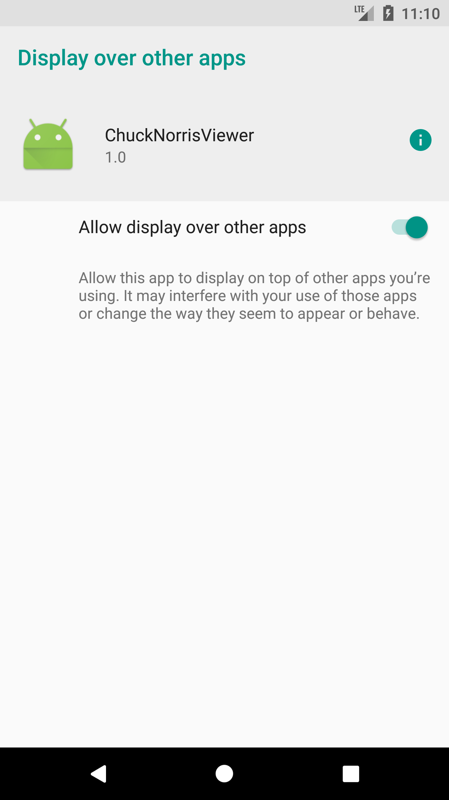

# ChuckNorrisViewer
- チャック・ノリスのジョークを表示するアプリです。
- アーキテクチャパターン第7章 チームとアーキテクチャ における、React Nativeハイブリッドアプリの説明のために作成されました。
- 実装の詳細は本書にて説明されています。



# Note
- Android版でのみ動作を保証しています。
- React Nativeは2017年12月時点最新バージョン(0.51.0)を利用しています。

# 実行
- 最新版のnpmをインストールしてください。
- ルートディレクトリ( `07-architecture-for-team/` 配下)にて以下のコマンドを実行してください。

```
npm install
react-native start
```

- Android Studioを起動し、アプリを実行します。
- 初回起動時に、Debugメニューのオーバーレイの許可を求める以下の画面が表示されます。必ず`Allow display over other apps`をONにしてください。


